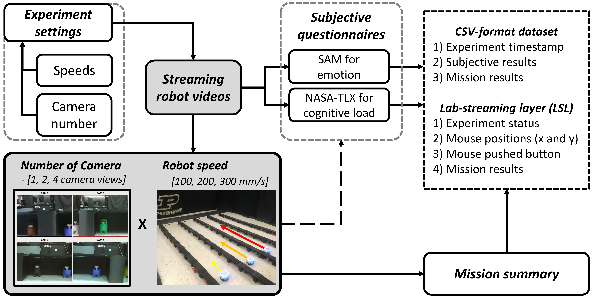
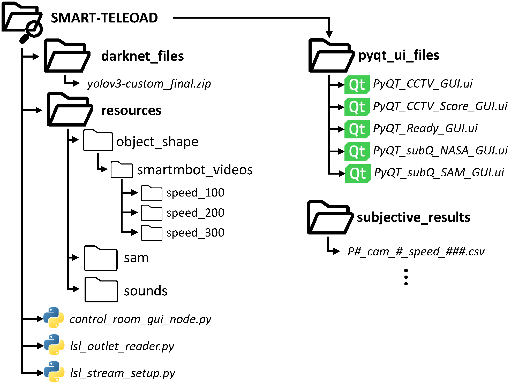

<div align="center">
	<h1>SMART-TeleLoad: A New Graphic User Interface <br> to Generate Affective Loads for Teleoperation </h1>
</div>
<div align="center">
	<h3><i>Wonse Jo, Go-Eum Cha, Dan Foti, and Byung-Cheol Min</i></h3>
</div>
<div align="center">
 	<h4><a href="http://www.smart-laboratory.org/" target="_blank">SMART Lab</a>, Purdue University</h4>
</div>


<div align="center">
	
</div>

## Overview
Teleoperation systems have advanced in recent years, offering many benefits to remote operators. However, they often overlook the affective loads that human operators experience and are related to the system performance directly and indirectly. Researchers attempt to understand the affective loads using stimuli from psychology, but these do not adequately generate affective loads in teleoperation scenarios. To address this gap, a new stimulus tool has been introduced, called SMART-TeleLoad. It is an open-source-based graphic user interface (GUI) program that can modulate various control variables relating to the stimulus as needed for research and practical applications. It also supports a lab-streaming layer (LSL) to connect with other systems like physiological sensors and other GUI programs, independent of operating systems. Furthermore, we validated the performance of the proposed stimulus tool by analyzing subjective questionnaires with aspects of the cognitive and emotional loads through an extensive user study involving 30 participants. 

## Demonstration Video
There is a demonstration video available at <https://youtu.be/qaYlWQdBHfI>, or click below image.

<div align="center">
	<a href="https://www.youtube.com/watch?v=qaYlWQdBHfI"> </a>
</div>

## Repository Files

This repository is composed of two main folders: 

* `doc`: paper and figures for this git
* `src`: main stimulus GUI programs and resources as below folder tree:

<div align="center">
	
</div>


  - `src/darknet_files`: including the essential cfg file and split weights zip files necessary for object detection algorithms.
  - `src/pyqt_ui_files`: including six UI design files used in the SMART-TeleLoad program
  - `src/resource`: having three folders including supplementary files, such as images, effect sounds, and pre-recorded video files.
  - `src/subjective_results`: saving directory for the human subject's answers and mission scores from the subjective questionnaire

  - `src/control_room_gui_node.py`:
  - `src/lsl_outlet_reader.py`: an example code to read the LSL stream data, which is an optional code for user to check the LSL outlet stream data. 
  - `src/lsl_stream_setup.py`: defining the LSL out streams which is connected to 


## Instruction tutorial
SMART-TeleLoad was inititaly developed in Python 3.8 under a Linux environment (e.g., Ubuntu 20.04), so it may not work on any other operating systems.
There is an instructional video available at <https://youtu.be/qaYlWQdBHfI> that demonstrates how to run codes and navigate the SMART-TeleLoad.

Before starting this program, your machine should have enabled cuDNN on OpenCV and below python libaries to run the main GUI program:

* cv2
* pandas
* playsound
* pylsl
* PyQt5

After installing the libaries, please 

1. `cd src` #to go to the `src` folder
2. `python control_room_gui_node.py` #run main program


## LSL outlets
There are four outlet streams to transmit the subject's information

(1) `teleload_mouse_pos`: It is to track the mouse cursor positions (x and y positions).

(2) `teleload_mouse_btn`: It is to recognize mouse button clicks (e.g., pressed or released) within the window of the GUI.

(3) `teleload_task_accuracy`: It is to measure the task accuracy based on the number of success and failure clicks.

(4) `teleload_exp_status`: It is to track the experiment status, such as the experiment start, preparation, main task, and  end.

## Output Files
The human subject's answers on the subjective questionnaires (e.g, SAM, NATA-TLX) and mission scores are saved to `src/subjective_results` as a CSV file named this format: 

`[participant number]_cam_[Camera number]_speed_[Moving speed].csv`. 

## Acknowledgement
This material is based upon work supported by the National Science Foundation under Grant No. IIS-1846221. Any opinions, findings, and conclusions or recommendations expressed in this material are those of the author(s) and do not necessarily reflect the views of the National Science Foundation.


## Citation
Please use the following citation:

Jo, W., Go, C., & Min, B. C. (2024). ''SMART-TeleLoad: A New Graphic User Interface to Generate Affective Loads for Teleoperation''. SoftwareX (accepted)


```
@article{smart_teleload_2024,
	title={SMART-TeleLoad: A New Graphic User Interface to Generate Affective Loads for Teleoperation},
	author={Wonse Jo and Go-eum Cha and Byung-Cheol Min},
	journal={SoftwareX},
	volume={},
 	number={},	
 	pages={},
 	year={2024},
 	publisher={},
 	doi={}
}
```


